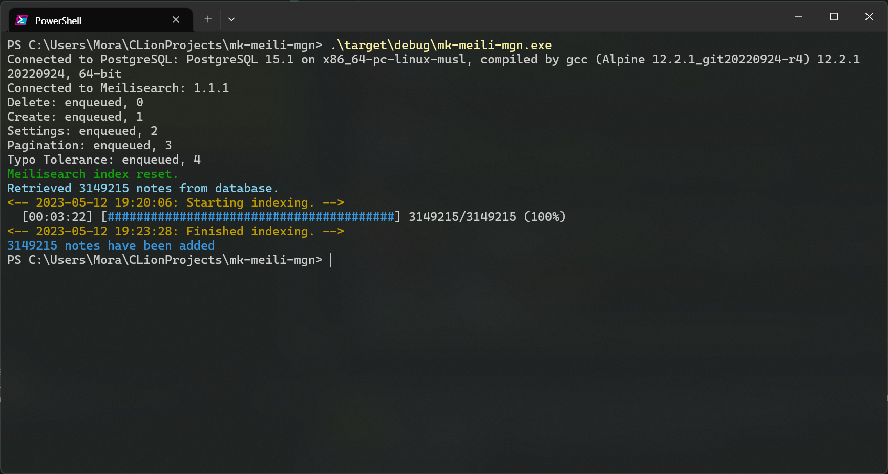

# Misskey Meilisearch Data Migration Tool

This tool is designed to migrate data from PostgreSQL to Meilisearch and is intended for use with Misskey instances.  
Results of the [Stella](https://stella.place) test, the migration involved importing 3,149,215 counts and took 3 minutes and 22 seconds.

