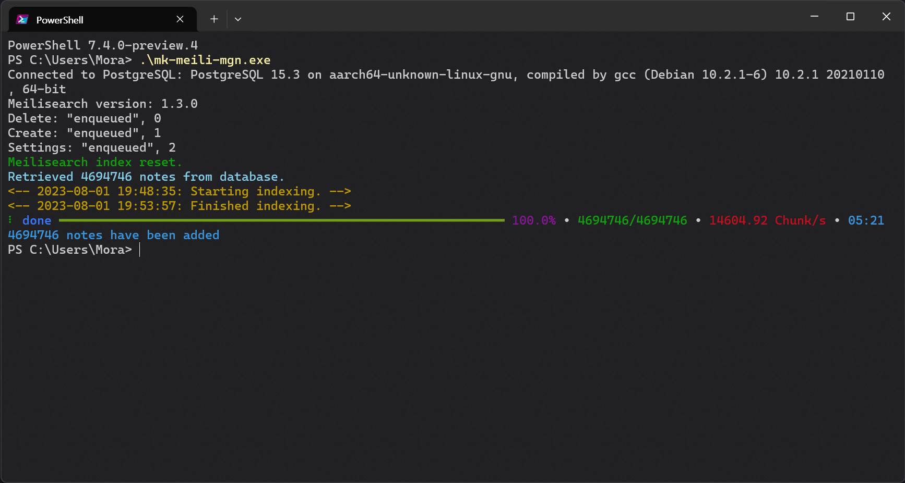

# Misskey Meilisearch Data Migration Tool

This tool is designed to migrate data from PostgreSQL to Meilisearch and is intended for use with Misskey instances.



## Warning
If you have Misskey 2023.11.0-beta.4 or earlier, please set the `idtype` in your configuration to `null`.

**Currently, we only support AID and AIDX.**

## Docker Image
```docker
asia-docker.pkg.dev/libnare/mk-meili-mgn/main:latest
```